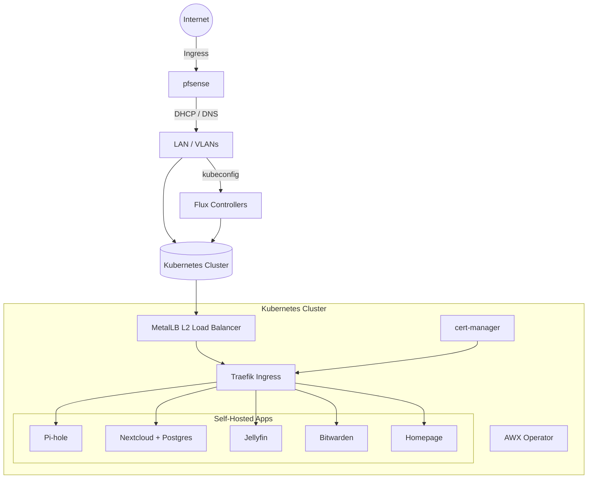
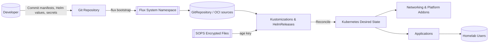

# Homelab GitOps

This repository defines an opinionated homelab platform powered by Flux, Helm, and SOPS/age. It bootstraps a Kubernetes cluster (tested with Minikube) with core networking addons and self-hosted applications such as Pi-hole, Nextcloud, Jellyfin, Bitwarden, and Homepage. Supporting scripts automate host preparation, pfSense configuration, and Flux bootstrapping so the cluster can be recreated repeatably.

## Architecture at a Glance



## GitOps Flow (Detailed)



## Preflight Checklist

Complete the following checks (in order) before launching any of the automation scripts. Treat the list as a hard prerequisite
so pfSense, Minikube, and Flux start from a known-good foundation.

1. **Verify hardware virtualization and libvirt access.**
   - Confirm that the host exposes Intel VT-x or AMD-V: `lscpu | grep -i virtualization`.
   - Ensure the KVM modules are available: `lsmod | grep kvm` and `sudo modprobe kvm_intel`/`kvm_amd` if missing.
   - Optional but recommended: `virt-host-validate` should report `PASS` for KVM acceleration.
   - Add your user to the `libvirt`, `kvm`, and `docker` groups (`sudo usermod -aG libvirt,kvm,docker "$(whoami)"`) and relog so
     virsh and Docker commands work without sudo.

2. **Install host packages and CLI tooling.**
   - Debian/Ubuntu operators can run `sudo ./scripts/host-prep.sh` to install libvirt, KVM, Docker CE, Minikube, kubectl, helm,
     SOPS, and supporting utilities in one shot.
   - On other distributions, install the equivalent packages manually: `qemu-system-x86`, `libvirt-daemon-system`,
     `libvirt-clients`, `virtinst`, `virt-viewer`, `bridge-utils`, `genisoimage` or `mkisofs`, `qemu-utils`, `conntrack`,
     `socat`, `iproute2`, `iptables`, `arptables`, `ebtables`, `python3`, and `openssl`.
   - Install container and GitOps CLIs that the scripts expect in `PATH`: Docker Engine, `kubectl`, `helm`, `minikube`, `flux`,
     `sops`, and `age` (`sudo apt install age` on Ubuntu or follow the upstream instructions for your platform).

3. **Enable background services.**
   - Start and enable libvirt and Docker: `sudo systemctl enable --now libvirtd docker`.
   - Validate libvirt connectivity with `virsh list --all`; the command should return without errors.

4. **Confirm toolchain versions.**
   - Run `minikube version`, `kubectl version --client`, `helm version`, `flux --version`, `sops --version`, and `age --version`
     to confirm the CLIs are callable.
   - The automation also shells out to `openssl`, `python3`, and `jq`; verify they are present if you installed packages
     manually.

5. **Download pfSense installation media.**
   - Fetch the pfSense CE serial image (`netgate-installer-amd64-serial.iso.gz`) from Netgate and note its absolute path. The
     serial build avoids a VNC dependency and matches the defaults baked into `pfsense/pf-bootstrap.sh`.
   - If you must use the VGA build, populate `PF_ISO_PATH` in `.env` and supply `--no-headless` when invoking `pf-bootstrap.sh`.

6. **Create and populate `.env`.**
   - Copy the sample file: `cp .env.example .env`.
   - Populate the domain, Minikube sizing, LAN/DHCP values, pfSense installer location, and storage paths. The
     [Plan LAN, DHCP, and MetalLB Addressing](#plan-lan-dhcp-and-metallb-addressing) section walks through picking safe values for
     `LAN_*` and MetalLB variables.
   - Ensure the legacy compatibility variables that feed the pfSense templates are present (`LAB_DOMAIN_BASE`, `LAB_CLUSTER_SUB`,
     `LAN_DHCP_FROM`, `LAN_DHCP_TO`). If they are absent from your existing `.env`, add them alongside the newer `LABZ_*`
     variables.

7. **Generate the pfSense configuration media.**
   - Run `./pfsense/pf-config-gen.sh` to render `config.xml` from your `.env` values and package it into
     `${WORK_ROOT}/pfsense/config/pfSense-config.iso`.
   - Install `genisoimage` or `mkisofs` beforehand (step 2) so the script can create the ISO. Rerun the generator whenever you
     change LAN addressing, DHCP scope, or host overrides.

8. **Define the pfSense VM before cluster bring-up.**
   - Execute `./pfsense/pf-bootstrap.sh --installation-path "$PF_SERIAL_INSTALLER_PATH"` to create the libvirt domain, attach the
     installer, and ensure the `pfSense_config` ISO is present on the secondary CD-ROM.
   - Keep the VM powered off until you are ready for first boot, then start it with `virsh start "${VM_NAME}"` and attach to the
     serial console via `virsh console "${VM_NAME}"` to watch the installer import the autogenerated configuration.

9. **Dry-run the automation preflight.**
   - Run `./scripts/preflight_and_bootstrap.sh --env-file ./.env --preflight-only` to let the preflight logic validate package
     installs, kernel modules, firewall state, and network assumptions without touching Minikube.
   - Resolve any reported blockers (for example, missing commands or conflicting address pools) before proceeding with the full
     bootstrap.

## Plan LAN, DHCP, and MetalLB Addressing

MetalLB and pfSense share the same L2 segment, so plan the LAN, DHCP, and VIP ranges deliberately before the automation rewrites
state. Update `.env` as you make selections so both the scripts and the pfSense templates stay in sync.

1. **Document the LAN network.**
   - Choose a RFC1918 subnet for the lab LAN (default `10.10.0.0/24`) and record the default gateway IP you want pfSense to use
     (default `10.10.0.1`). Set these values in `.env` (`LAN_CIDR`, `LAN_GW_IP`).
   - If you reuse an existing LAN, double-check that no upstream DHCP server overlaps with the range you plan to dedicate to the
     homelab.

2. **Pick a DHCP scope that avoids VIPs.**
   - Define `LAN_DHCP_FROM` and `LAN_DHCP_TO` so they exclude the static VIP space you reserve for MetalLB and any other
     infrastructure nodes. A common pattern is `10.10.0.100-10.10.0.199` for DHCP leases while keeping `.1` for pfSense and the
     `.200+` range for services.
   - Enter the same range under **Services → DHCP Server → LAN** once pfSense boots so the GUI mirrors what the automation
     expects.

3. **Allocate a contiguous MetalLB pool.**
   - Reserve at least 5–10 contiguous IPs inside the LAN for load-balanced services (for example `10.10.0.240-10.10.0.250`).
   - Update `.env` with `LABZ_METALLB_RANGE`, `METALLB_POOL_START`, `METALLB_POOL_END`, and set `TRAEFIK_LOCAL_IP` to the first
     address in the range.
   - The pfSense templates consume these values to pre-provision DNS overrides for Traefik, Grafana, Prometheus, Alertmanager,
     and AWX, so regenerate the config ISO any time the pool changes.

4. **Keep compatibility variables aligned.**
   - Set `LAB_DOMAIN_BASE` to the same value as `LABZ_DOMAIN` (for example, `labz.home.arpa`) and verify `LAB_CLUSTER_SUB`
     matches the delegated subdomain used by Kubernetes ingresses (`lab-minikube.labz.home.arpa` by default).
   - These variables make sure pfSense advertises host overrides such as `app.lab-minikube.labz.home.arpa` with the correct VIP.

5. **Use the preflight script to validate the plan.**
   - `./scripts/preflight_and_bootstrap.sh --env-file ./.env --preflight-only --assume-yes` prints the detected LAN context and
     the MetalLB pool it intends to apply (look for `MetalLB pool selected: 10.10.0.240-10.10.0.250`).
   - The script persists the last-known network fingerprint in `~/.homelab/state.json`. If it reports a fingerprint change,
     verify you are still on the correct uplink before continuing.

6. **Resolve conflicts reported by the automation.**
   - Warnings such as `Pool 10.10.0.240-10.10.0.250 in use; trying next candidate` or `Falling back to first candidate … despite
     conflicts` indicate another device is already claiming addresses in the proposed range.
   - Check pfSense's DHCP leases (**Status → DHCP Leases**) or run `ip neigh`/`arp -an` on the host to identify the offender,
     then either reclaim the IP or pick a different VIP block and update `.env`.
   - After editing `.env`, regenerate the pfSense config ISO and rerun the preflight check until it selects a conflict-free range.
     If you need to discard stale assumptions, delete `~/.homelab/state.json` before rerunning the script.

7. **Coordinate pfSense DHCP and DNS with the chosen pool.**
   - Once the values settle, verify that pfSense hands out its own LAN IP as the primary DNS server and that the DHCP range does
     not overlap the MetalLB pool. Reapply the generated configuration ISO if pfSense was provisioned previously.

## Quick Start

1. **Clone the repository and prepare environment variables**
   ```bash
   cp .env.example .env
   # Edit passwords, IP ranges, and storage paths to match your environment
   ```
   Complete the [Preflight Checklist](#preflight-checklist) and the
   [Plan LAN, DHCP, and MetalLB Addressing](#plan-lan-dhcp-and-metallb-addressing) steps before proceeding. Ensure
   `PF_SERIAL_INSTALLER_PATH` points at the gzipped pfSense serial installer and adjust `PF_HEADLESS` if you prefer a VNC console (`--no-headless`).

2. **Generate pfSense media and define the VM**
   ```bash
   ./pfsense/pf-config-gen.sh
   ./pfsense/pf-bootstrap.sh --installation-path "$PF_SERIAL_INSTALLER_PATH"
   virsh start "${VM_NAME}"    # boot when ready and watch via 'virsh console ${VM_NAME}'
   ```
   Re-run `pf-config-gen.sh` any time you adjust addressing or DNS overrides so the ISO matches the latest `.env` values. The
   bootstrap script is idempotent and reattaches the ISO if the VM is powered off.

3. **Provision or reset the homelab cluster**
   ```bash
   ./scripts/uranus_homelab.sh --delete-previous-environment --assume-yes --env-file ./.env
   ```
   The helper script prepares the host, launches Minikube with the desired configuration, installs the core addons, and invokes the imperative app deployment helpers in `scripts/`. Ensure `kubectl`, `helm`, `minikube`, and `openssl` are installed and available in your `PATH` before running the helper scripts. You can run the same workflow from the Makefile:
   ```bash
   make up
   ```
   The pfSense VM boots with the serial installer by default; attach to the console with `virsh console "${VM_NAME}"` once the domain is defined. Pass `--no-headless` to `pfsense/pf-bootstrap.sh` if you need to re-enable a graphical viewer.

4. **Bootstrap Flux against your Git remote**
   ```bash
   flux check --pre
   flux bootstrap github \
     --owner <github-user-or-org> \
     --repository homelab_gitops \
     --path clusters/minikube
   ```
   Adjust the bootstrap command for your Git provider (GitHub, GitLab, etc.) and cluster path.

   Flux currently reconciles the `k8s/base` tree, which now includes the Django multiproject demo alongside the core namespaces and addon scaffolding. The remaining `k8s/apps/*` directories are placeholders until their manifests are migrated into Flux; for now those workloads are deployed by `scripts/uranus_homelab_apps.sh`.

5. **Access the applications**
   - Configure pfSense DNS overrides (see [pfSense DNS and DHCP Configuration](#pfsense-dns-and-dhcp-configuration)).
   - Use the published ingress hostnames such as `https://app.lab-minikube.labz.home.arpa/` for the Django multiproject demo (Traefik terminates TLS and routes traffic internally).
   - Traefik still uses a MetalLB VIP, but workloads are accessed through their DNS entries rather than a service load balancer IP.

## Post-Bootstrap Validation

Run these checks after `scripts/uranus_homelab.sh` (or `make up`) completes and before handing the environment to other operators.

1. **Verify cluster health.**
   ```bash
   kubectl get nodes -o wide
   kubectl get pods --all-namespaces
   kubectl -n metallb-system get ippools,l2advertisements
   kubectl -n traefik get svc traefik -o wide
   kubectl -n cert-manager get certificaterequests,certificates
   ```
   Confirm that the Traefik service reports the `EXTERNAL-IP` you set in `.env` and that all addon pods are in the `Running` or `Completed` phase.

2. **Check Flux reconciliation (after bootstrap).**
   ```bash
   flux check
   flux get sources all
   flux get kustomizations
   ```
   Resolve any failed reconciliation before proceeding to application smoke tests.

3. **Validate pfSense DNS and DHCP behavior.**
   - From a workstation that obtained its address via pfSense, run `dig traefik.${LABZ_DOMAIN} @${LAN_GW_IP}` and confirm the response equals `${TRAEFIK_LOCAL_IP}`.
   - Use `dig app.${LAB_CLUSTER_SUB} @${LAN_GW_IP}` to confirm the additional host overrides point at the correct MetalLB VIPs.
   - Review **Status → DHCP Leases** in the pfSense UI to ensure clients are receiving addresses within the range you defined.

4. **Spot-check ingress and certificates.**
   ```bash
   curl -kI https://traefik.${LABZ_DOMAIN}
   curl -kI https://app.${LAB_CLUSTER_SUB}
   ```
   Both commands should return `HTTP/2 200` with a certificate issued by the internal CA.

5. **Inspect saved diagnostics.**
   - The preflight script writes the evaluated network fingerprint and MetalLB assignment to `~/.homelab/state.json`. Archive this file with the bootstrap logs so future runs can detect unexpected network changes.

## Version Management and Pre-Rollout Testing

Kubernetes, networking addons, and Helm-installed workloads are pinned through environment variables so bootstrap scripts and Flux reconcile against the same chart releases. The defaults live in `.env.example`:

- `LABZ_KUBERNETES_VERSION`
- `METALLB_HELM_VERSION`
- `TRAEFIK_HELM_VERSION`
- `CERT_MANAGER_HELM_VERSION`
- `LABZ_POSTGRES_HELM_VERSION`
- `LABZ_KPS_HELM_VERSION`

The table below tracks the current upstream release alongside the pinned "n-1"
version that automation exercises. Update both columns when planning a new
upgrade so the lab and Flux stay in lockstep.

| Component | Latest stable (n) | Pinned (n-1) |
| --- | --- | --- |
| Kubernetes | v1.32.0 | v1.31.3 |
| MetalLB | 0.14.8 | 0.14.7 |
| Traefik Helm chart | 28.0.0 | 27.0.2 |
| cert-manager Helm chart | 1.17.1 | 1.16.3 |
| Flux CLI | 2.4.0 | 2.3.0 |
| Bitnami PostgreSQL Helm chart | 17.0.2 | 16.2.6 |
| kube-prometheus-stack Helm chart | 66.2.0 | 65.5.0 |
| AWX operator Helm chart | 2.21.0 | 2.20.0 |

When bumping versions:

1. Update `.env` (and mirror the change in `.env.example`) with the new chart or Kubernetes release numbers.
2. Edit the Flux HelmReleases so the controller targets the same versions (for example, `k8s/addons/{metallb,traefik,cert-manager}/release.yaml`).
3. Review scripts or manifests that reference those versions (such as the Makefile `db`/`obs` targets) to confirm they inherit the new values.
4. Smoke test locally before merging:
   - Recreate Minikube if necessary (`minikube delete -p uranus`).
   - Run `make k8s` to bring up the core addons with the pinned charts.
   - Execute `make db` and `make obs` to ensure the data and observability stacks install with the new chart versions.
   - Spot-check `helm list -A` and `kubectl get pods --all-namespaces` for healthy rollouts.

Document the results in the pull request so the Flux-managed environments can be updated confidently.

## Secrets Management with SOPS and age

Secrets are stored as SOPS-encrypted YAML files within the repository so that manifests can be committed without exposing credentials. The sample application secrets live under `apps/*/sops-secrets/` and should be encrypted before they are committed or applied.

- The default age key is stored in `.sops/age.key`. Generate one if it does not exist:
  ```bash
  mkdir -p .sops
  age-keygen -o .sops/age.key
  export SOPS_AGE_KEY_FILE=.sops/age.key
  ```
  Exporting `SOPS_AGE_KEY_FILE` ensures both the local `sops` CLI and Flux controllers know where to read the private key during
  reconciliation. Commit the public recipient (in `.sops/.sops.yaml`) but keep `.sops/age.key` out of Git; instead, create a
  Kubernetes secret (e.g., `flux-system/sops-age`) that mounts the file for Flux.
- Encrypt or update a secret in place (for example, the Pi-hole admin password template):
  ```bash
  sops --encrypt --in-place apps/pihole/sops-secrets/admin-secret.yaml
  ```
- Decrypt for editing:
  ```bash
  sops apps/pihole/sops-secrets/admin-secret.yaml
  ```

If an app has not yet been migrated to Flux, keep its encrypted secret alongside the imperative deployment assets until the GitOps manifests are authored. The repository includes placeholders such as `k8s/apps/nextcloud` to track the future Flux layout, but those directories do not yet contain live manifests.

Flux decrypts the files at reconciliation time by mounting the age key secret. Keep the `.sops/age.key` file out of version control unless you intentionally share the key with trusted collaborators.

## Local linting with pre-commit

This repository uses [pre-commit](https://pre-commit.com/) to provide fast feedback for common formatting and linting issues (YAML structure, trailing newlines, shell scripts, etc.). Install the framework once and enable the Git hook:

```bash
pipx install pre-commit  # or: pip install --user pre-commit
pre-commit install
```

Run the full suite against the entire repository whenever dependencies change or before submitting a pull request:

```bash
pre-commit run --all-files
```

The hooks defined in `.pre-commit-config.yaml` mirror the checks enforced in CI so contributors see the same results locally.
### Rotate AWX admin credentials

The AWX instance defined in `awx/awx-small.yaml` consumes the `awx-admin` secret, which now lives under `awx/sops-secrets/awx-admin.sops.yaml` so it can be managed with SOPS. To create or rotate the administrator password:

1. Ensure your age key is configured (`export SOPS_AGE_KEY_FILE=.sops/age.key`).
2. Decrypt the secret for editing: `sops awx/sops-secrets/awx-admin.sops.yaml`.
3. Generate a new password (for example `python3 -c 'import secrets,string; print("".join(secrets.choice(string.ascii_letters + string.digits) for _ in range(24)))'`).
4. Replace the `stringData.password` value with the new password and save the file.
5. Re-encrypt the manifest: `sops --encrypt --in-place awx/sops-secrets/awx-admin.sops.yaml`.
6. Apply the updated secret to the cluster: `kubectl apply -f awx/sops-secrets/awx-admin.sops.yaml`.
7. Update the live AWX admin account so it matches the secret: `kubectl -n awx exec deployment/awx-task -- awx-manage changepassword admin '<new-password>'` (supply the password via `read -s` or your clipboard manager to avoid leaving it in shell history).
8. Optionally bounce the AWX web/task pods if the operator does not reconcile immediately: `kubectl -n awx delete pod -l app.kubernetes.io/name=awx --grace-period=0 --force`.

Store the regenerated password in your password manager after the rotation.

## pfSense DNS and DHCP Configuration

Follow these steps after the pfSense installer completes and before onboarding workstations to the lab network.

1. **Confirm the imported bootstrap settings.**
   - Sign in to the pfSense UI and browse to **System → General Setup**. The hostname should read `uranus-pfsense`, the domain should match `LAB_DOMAIN_BASE`, and the upstream DNS servers should reflect the defaults (`1.1.1.1`, `9.9.9.9`) unless you override them.
   - Visit **Interfaces → LAN** and verify the static IPv4 address equals `LAN_GW_IP` with the expected subnet mask.

2. **Enable and align the DHCP server.**
   - Navigate to **Services → DHCP Server → LAN**. Enable the server, set the range to the `LAN_DHCP_FROM`/`LAN_DHCP_TO` values from `.env`, and set the default lease time to 7200 seconds (2 hours) or your preferred value.
   - Under the same screen, set **DNS Servers** to the pfSense LAN IP (`LAN_GW_IP`) and **Domain name** to `LABZ_DOMAIN` so clients inherit the correct search suffix.
   - Disable any competing DHCP service on the upstream network to avoid split-brain leases.

3. **Review DNS Resolver host overrides.**
   - Go to **Services → DNS Resolver → Host Overrides**. The bootstrap ISO seeds the following entries; adjust or extend them as needed when application VIPs change.

     | Hostname | Target | Notes |
     | --- | --- | --- |
     | `traefik.${LABZ_DOMAIN}` | MetalLB virtual IP in `${LABZ_METALLB_RANGE}` | Primary ingress endpoint |
     | `app.lab-minikube.${LABZ_DOMAIN}` | Same MetalLB VIP as Traefik | Django multiproject demo |
     | `cloud.${LABZ_DOMAIN}` | Same MetalLB VIP as Traefik | Nextcloud |
     | `media.${LABZ_DOMAIN}` | Same MetalLB VIP as Traefik | Jellyfin |
     | `grafana.lab-minikube.${LABZ_DOMAIN}` / `prom.lab-minikube.${LABZ_DOMAIN}` / `alert.lab-minikube.${LABZ_DOMAIN}` | VIPs derived from `METALLB_POOL_START` | Observability stack |
     | `awx.lab-minikube.${LABZ_DOMAIN}` | VIP derived from `METALLB_POOL_START` | AWX UI |

   - Use a TTL of 300 seconds (5 minutes). If you rebuild the MetalLB pool, rerun `./pfsense/pf-config-gen.sh` and reattach the ISO with `./pfsense/pf-bootstrap.sh` to refresh these overrides automatically.

4. **Test name resolution and leases.**
   - From pfSense, use **Diagnostics → DNS Lookup** to query `traefik.${LABZ_DOMAIN}` and confirm it returns `${TRAEFIK_LOCAL_IP}`.
   - From a DHCP client, run `ipconfig /renew` (Windows), `sudo dhclient -v <interface>` (Linux), or toggle Wi-Fi to ensure the new lease supplies pfSense as the DNS server and that the hostname overrides resolve.

5. **Update the configuration when `.env` changes.**
   - Any time you adjust LAN addressing, DHCP scope, or VIP assignments in `.env`, rerun `./pfsense/pf-config-gen.sh` followed by `./pfsense/pf-bootstrap.sh`. For already-running VMs, either stop the guest before rerunning the bootstrap script or execute `virsh change-media` manually to swap the ISO.

Keeping pfSense and MetalLB synchronized avoids overlapping leases and ensures DNS entries always point at the intended load balancer IPs.

## Repository Layout

```text
.
├── apps/                       # Imperative manifests/scripts used by helper automation
│   ├── django-multiproject/    # Legacy example manifests (Flux-managed version lives in k8s/apps/django-multiproject)
│   └── pihole/                 # Sample secrets (encrypt with SOPS before use)
├── clusters/
│   └── minikube/               # Flux bootstrap configuration for the minikube cluster
├── data/                       # Persistent data scaffolding (e.g., Postgres volumes)
├── flux/                       # Flux installation helper scripts
├── k8s/                        # Kubernetes manifests organized by component
│   ├── addons/                 # MetalLB, Traefik, cert-manager, AWX Operator, etc.
│   ├── apps/                   # Flux-managed applications (Django multiproject demo plus placeholders for future apps)
│   ├── base/                   # Aggregates addons and (placeholder) app trees for Flux
│   ├── cert-manager/           # Additional cert-manager configuration
│   └── traefik/                # Traefik-specific manifests
├── observability/              # Monitoring related values (e.g., kps-values.yaml)
├── pfsense/                    # pfSense bootstrap and configuration templates
├── scripts/                    # Host/bootstrap automation (uranus_* helpers)
├── Makefile                    # Convenience targets for bootstrap workflows
└── README.md                   # This document
```

Additional documentation lives in `docs/`, including release notes (`docs/CHANGELOG.md`).
