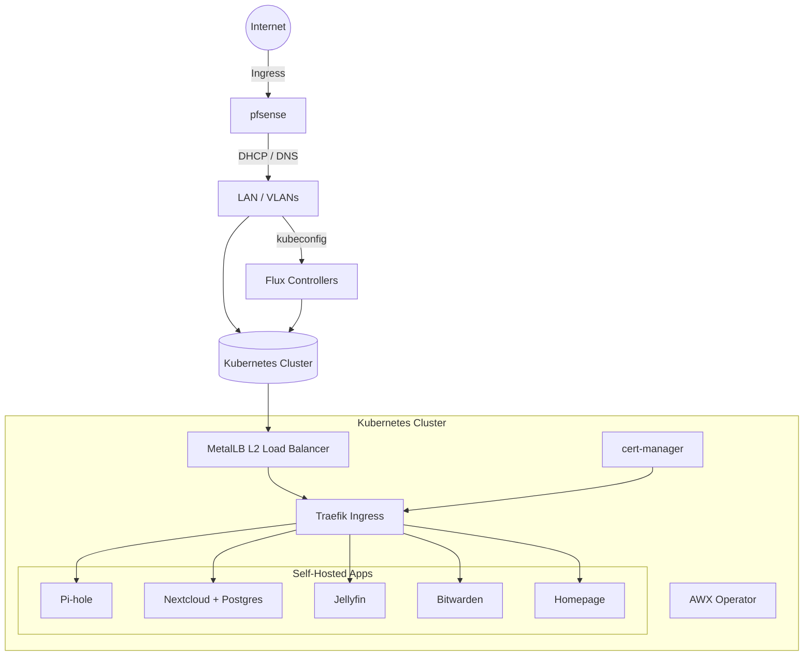
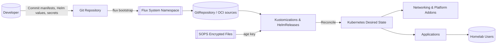

# Homelab GitOps

This repository defines an opinionated homelab platform powered by Flux, Helm, and SOPS/age. It bootstraps a Kubernetes cluster (tested with Minikube) with core networking addons and self-hosted applications such as Pi-hole, Nextcloud, Jellyfin, Bitwarden, and Homepage. Supporting scripts automate host preparation, pfSense configuration, and Flux bootstrapping so the cluster can be recreated repeatably.

## Architecture at a Glance



## GitOps Flow (Detailed)



## Quick Start

1. **Clone the repository and prepare environment variables**
   ```bash
   cp .env.example .env
   # Edit passwords, IP ranges, and storage paths to match your environment
   ```
   Ensure `PF_SERIAL_INSTALLER_PATH` points at the gzipped pfSense serial installer and adjust `PF_HEADLESS` if you prefer a VNC console (`--no-headless`).

2. **Provision or reset the homelab cluster**
   ```bash
   ./scripts/uranus_homelab.sh --delete-previous-environment --assume-yes --env-file ./.env
   ```
   The helper script prepares the host, launches Minikube with the desired configuration, installs the core addons, and invokes the imperative app deployment helpers in `scripts/`. Ensure `kubectl`, `helm`, `minikube`, and `openssl` are installed and available in your `PATH` before running the helper scripts. You can run the same workflow from the Makefile:
   ```bash
   make up
   ```
   The pfSense VM boots with the serial installer by default; attach to the console with `virsh console "${VM_NAME}"` once the domain is defined. Pass `--no-headless` to `pfsense/pf-bootstrap.sh` if you need to re-enable a graphical viewer.

3. **Bootstrap Flux against your Git remote**
   ```bash
   flux check --pre
   flux bootstrap github \
     --owner <github-user-or-org> \
     --repository homelab_gitops \
     --path clusters/minikube
   ```
   Adjust the bootstrap command for your Git provider (GitHub, GitLab, etc.) and cluster path.

   Flux currently reconciles the `k8s/base` tree (core namespaces and addon scaffolding). The `k8s/apps/*` directories are placeholders until the application manifests are migrated into Flux; for now the workloads are deployed by `scripts/uranus_homelab_apps.sh`.

4. **Access the applications**
   - Configure pfSense DNS overrides (see below).
   - Use the published ingress hostnames such as `https://app.lab-minikube.labz.home.arpa/` for the Django multiproject demo (Traefik terminates TLS and routes traffic internally).
   - Traefik still uses a MetalLB VIP, but workloads are accessed through their DNS entries rather than a service load balancer IP.

## Version Management and Pre-Rollout Testing

Kubernetes, networking addons, and Helm-installed workloads are pinned through environment variables so bootstrap scripts and Flux reconcile against the same chart releases. The defaults live in `.env.example`:

- `LABZ_KUBERNETES_VERSION`
- `METALLB_HELM_VERSION`
- `TRAEFIK_HELM_VERSION`
- `CERT_MANAGER_HELM_VERSION`
- `LABZ_POSTGRES_HELM_VERSION`
- `LABZ_KPS_HELM_VERSION`

When bumping versions:

1. Update `.env` (and mirror the change in `.env.example`) with the new chart or Kubernetes release numbers.
2. Edit the Flux HelmReleases so the controller targets the same versions (for example, `k8s/addons/{metallb,traefik,cert-manager}/release.yaml`).
3. Review scripts or manifests that reference those versions (such as the Makefile `db`/`obs` targets) to confirm they inherit the new values.
4. Smoke test locally before merging:
   - Recreate Minikube if necessary (`minikube delete -p uranus`).
   - Run `make k8s` to bring up the core addons with the pinned charts.
   - Execute `make db` and `make obs` to ensure the data and observability stacks install with the new chart versions.
   - Spot-check `helm list -A` and `kubectl get pods --all-namespaces` for healthy rollouts.

Document the results in the pull request so the Flux-managed environments can be updated confidently.

## Secrets Management with SOPS and age

Secrets are stored as SOPS-encrypted YAML files within the repository so that manifests can be committed without exposing credentials. The sample application secrets live under `apps/*/sops-secrets/` and should be encrypted before they are committed or applied.

- The default age key is stored in `.sops/age.key`. Generate one if it does not exist:
  ```bash
  mkdir -p .sops
  age-keygen -o .sops/age.key
  export SOPS_AGE_KEY_FILE=.sops/age.key
  ```
  Exporting `SOPS_AGE_KEY_FILE` ensures both the local `sops` CLI and Flux controllers know where to read the private key during
  reconciliation. Commit the public recipient (in `.sops/.sops.yaml`) but keep `.sops/age.key` out of Git; instead, create a
  Kubernetes secret (e.g., `flux-system/sops-age`) that mounts the file for Flux.
- Encrypt or update a secret in place (for example, the Pi-hole admin password template):
  ```bash
  sops --encrypt --in-place apps/pihole/sops-secrets/admin-secret.yaml
  ```
- Decrypt for editing:
  ```bash
  sops apps/pihole/sops-secrets/admin-secret.yaml
  ```

If an app has not yet been migrated to Flux, keep its encrypted secret alongside the imperative deployment assets until the GitOps manifests are authored. The repository includes placeholders such as `k8s/apps/nextcloud` to track the future Flux layout, but those directories do not yet contain live manifests.

Flux decrypts the files at reconciliation time by mounting the age key secret. Keep the `.sops/age.key` file out of version control unless you intentionally share the key with trusted collaborators.

### Rotate AWX admin credentials

The AWX instance defined in `awx/awx-small.yaml` consumes the `awx-admin` secret, which now lives under `awx/sops-secrets/awx-admin.sops.yaml` so it can be managed with SOPS. To create or rotate the administrator password:

1. Ensure your age key is configured (`export SOPS_AGE_KEY_FILE=.sops/age.key`).
2. Decrypt the secret for editing: `sops awx/sops-secrets/awx-admin.sops.yaml`.
3. Generate a new password (for example `python3 -c 'import secrets,string; print("".join(secrets.choice(string.ascii_letters + string.digits) for _ in range(24)))'`).
4. Replace the `stringData.password` value with the new password and save the file.
5. Re-encrypt the manifest: `sops --encrypt --in-place awx/sops-secrets/awx-admin.sops.yaml`.
6. Apply the updated secret to the cluster: `kubectl apply -f awx/sops-secrets/awx-admin.sops.yaml`.
7. Update the live AWX admin account so it matches the secret: `kubectl -n awx exec deployment/awx-task -- awx-manage changepassword admin '<new-password>'` (supply the password via `read -s` or your clipboard manager to avoid leaving it in shell history).
8. Optionally bounce the AWX web/task pods if the operator does not reconcile immediately: `kubectl -n awx delete pod -l app.kubernetes.io/name=awx --grace-period=0 --force`.

Store the regenerated password in your password manager after the rotation.

## pfSense DNS Overrides

Point lab devices at pfSense for DNS resolution and add host overrides via **Services → DNS Resolver → Host Overrides**:

| Hostname | Target | Notes |
| --- | --- | --- |
| `traefik.${LABZ_DOMAIN}` | MetalLB virtual IP in `${LABZ_METALLB_RANGE}` | Primary ingress endpoint |
| `app.lab-minikube.${LABZ_DOMAIN}` | Same MetalLB VIP as Traefik | Django multiproject demo |
| `cloud.${LABZ_DOMAIN}` | Same MetalLB VIP as Traefik | Nextcloud |
| `media.${LABZ_DOMAIN}` | Same MetalLB VIP as Traefik | Jellyfin |

Use a TTL of 300 seconds (5 minutes). Ensure pfSense hands out its own IP as the DNS server via DHCP so clients honor the overrides.

## Repository Layout

```text
.
├── apps/                       # Imperative manifests/scripts used by helper automation
│   ├── django-multiproject/    # Example workload applied by scripts/uranus_homelab_apps.sh
│   └── pihole/                 # Sample secrets (encrypt with SOPS before use)
├── clusters/
│   └── minikube/               # Flux bootstrap configuration for the minikube cluster
├── data/                       # Persistent data scaffolding (e.g., Postgres volumes)
├── flux/                       # Flux installation helper scripts
├── k8s/                        # Kubernetes manifests organized by component
│   ├── addons/                 # MetalLB, Traefik, cert-manager, AWX Operator, etc.
│   ├── apps/                   # Placeholders reserved for future Flux-managed apps
│   ├── base/                   # Aggregates addons and (placeholder) app trees for Flux
│   ├── cert-manager/           # Additional cert-manager configuration
│   └── traefik/                # Traefik-specific manifests
├── observability/              # Monitoring related values (e.g., kps-values.yaml)
├── pfsense/                    # pfSense bootstrap and configuration templates
├── scripts/                    # Host/bootstrap automation (uranus_* helpers)
├── Makefile                    # Convenience targets for bootstrap workflows
└── README.md                   # This document
```

Additional documentation lives in `docs/`, including release notes (`docs/CHANGELOG.md`).
