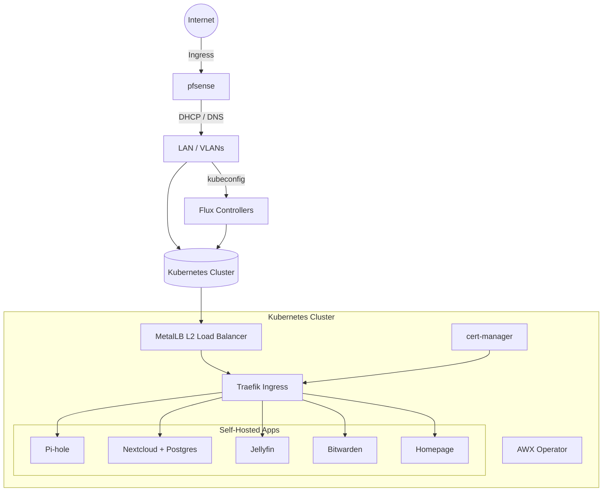
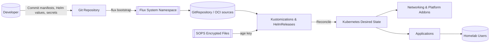

# Homelab GitOps

This repository defines an opinionated homelab platform powered by Flux, Helm, and SOPS/age. It bootstraps a Kubernetes cluster (tested with Minikube) with core networking addons and self-hosted applications such as Pi-hole, Nextcloud, Jellyfin, Bitwarden, and Homepage. Supporting scripts automate host preparation, pfSense configuration, and Flux bootstrapping so the cluster can be recreated repeatably.

## Architecture at a Glance



## GitOps Flow (Detailed)



## Quick Start

1. **Clone the repository and prepare environment variables**
   ```bash
   cp .env.example .env
   # Edit passwords, IP ranges, and storage paths to match your environment
   ```

2. **Provision or reset the homelab cluster**
   ```bash
   ./scripts/uranus_homelab.sh --delete-previous-environment --assume-yes --env-file ./.env
   ```
   The helper script prepares the host, launches Minikube with the desired configuration, and applies the GitOps manifests. Ensure `kubectl`, `helm`, `minikube`, and `openssl` are installed and available in your `PATH` before running the helper scripts. You can run the same workflow from the Makefile:
   ```bash
   make up
   ```

3. **Bootstrap Flux against your Git remote**
   ```bash
   flux check --pre
   flux bootstrap github \
     --owner <github-user-or-org> \
     --repository homelab_gitops \
     --path clusters/minikube
   ```
   Adjust the bootstrap command for your Git provider (GitHub, GitLab, etc.) and cluster path.

4. **Access the applications**
   - Configure pfSense DNS overrides (see below).
   - Point a browser at the Traefik, Nextcloud, or other application hostnames once MetalLB assigns VIPs.

## Secrets Management with SOPS and age

Secrets are stored as SOPS-encrypted YAML files within the repository so that manifests can be committed without exposing credentials.

- The default age key is stored in `.sops/age.key`. Generate one if it does not exist:
  ```bash
  mkdir -p .sops
  age-keygen -o .sops/age.key
  export SOPS_AGE_KEY_FILE=.sops/age.key
  ```
- Encrypt or update a secret in place:
  ```bash
  sops --encrypt --in-place k8s/apps/nextcloud/values.yaml
  ```
- Decrypt for editing:
  ```bash
  sops k8s/apps/nextcloud/values.yaml
  ```

Flux decrypts the files at reconciliation time by mounting the age key secret. Keep the `.sops/age.key` file out of version control unless you intentionally share the key with trusted collaborators.

## pfSense DNS Overrides

Point lab devices at pfSense for DNS resolution and add host overrides via **Services → DNS Resolver → Host Overrides**:

| Hostname | Target | Notes |
| --- | --- | --- |
| `traefik.${LABZ_DOMAIN}` | MetalLB virtual IP in `${LABZ_METALLB_RANGE}` | Primary ingress endpoint |
| `cloud.${LABZ_DOMAIN}` | Same MetalLB VIP as Traefik | Nextcloud |
| `media.${LABZ_DOMAIN}` | Same MetalLB VIP as Traefik | Jellyfin |

Use a TTL of 300 seconds (5 minutes). Ensure pfSense hands out its own IP as the DNS server via DHCP so clients honor the overrides.

## Repository Layout

```text
.
├── apps/                       # Application Helm charts or manifests
│   ├── django-multiproject
│   └── pihole
├── clusters/
│   └── minikube/               # Flux bootstrap configuration for the minikube cluster
├── data/                       # Persistent data scaffolding (e.g., Postgres volumes)
├── flux/                       # Flux installation helper scripts
├── k8s/                        # Kubernetes manifests organized by component
│   ├── addons/                 # MetalLB, Traefik, cert-manager, AWX Operator, etc.
│   ├── apps/                   # Application HelmRelease definitions and values
│   ├── base/                   # Shared namespaces and RBAC
│   ├── cert-manager/           # Additional cert-manager configuration
│   └── traefik/                # Traefik-specific manifests
├── observability/              # Monitoring related values (e.g., kps-values.yaml)
├── pfsense/                    # pfSense bootstrap and configuration templates
├── scripts/                    # Host/bootstrap automation (uranus_* helpers)
├── Makefile                    # Convenience targets for bootstrap workflows
└── README.md                   # This document
```

Additional documentation lives in `docs/`, including release notes (`docs/CHANGELOG.md`).
